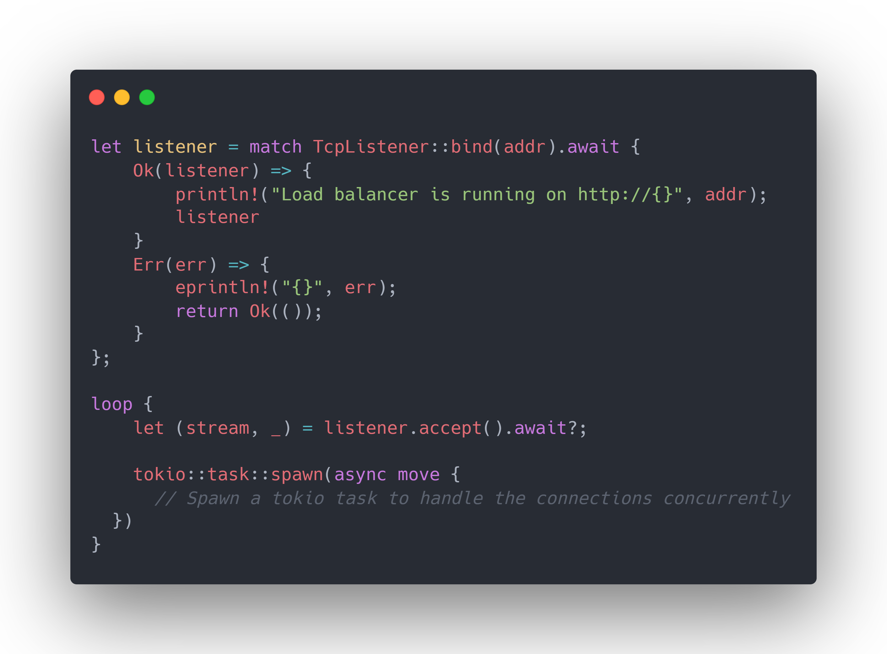
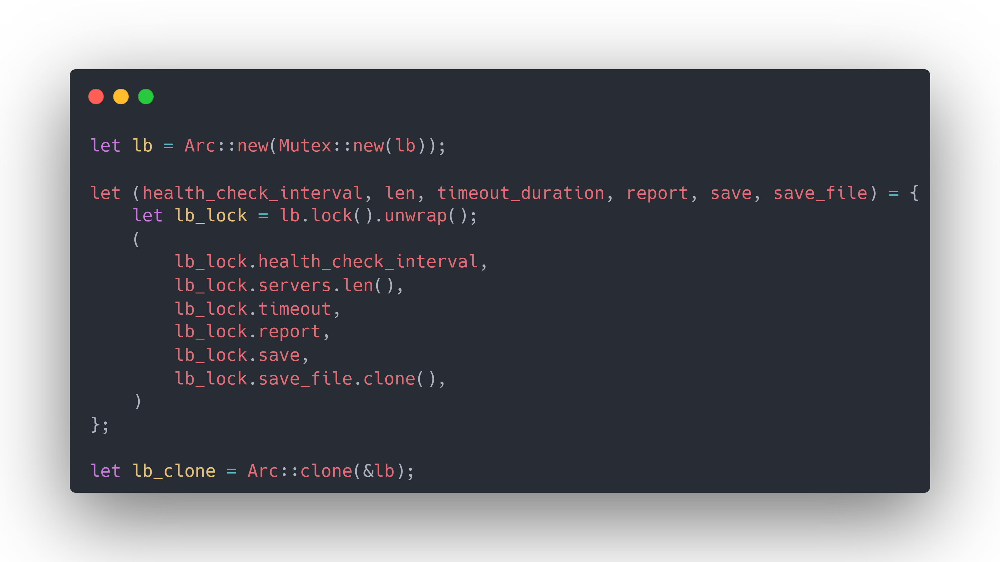
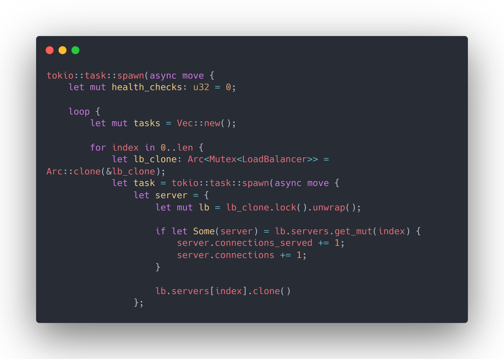
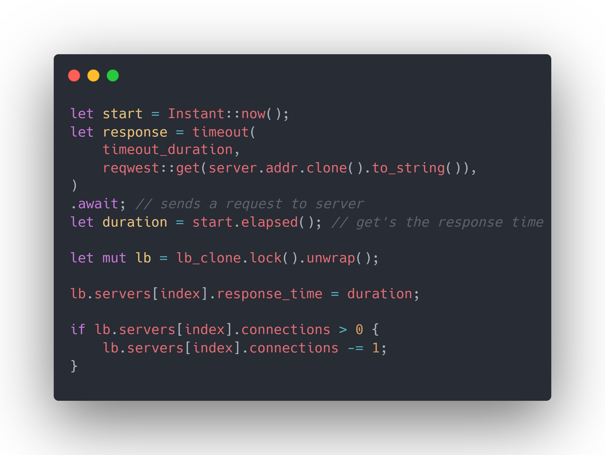

# Building a simple Load Balancer in Rust
Written By [Pranav V Bhat](github.com/Prana-vvb)  
10 Aug 2024

## Why does my load need to be balanced?
Let's say you have a few servers and are hosting a website. Great! Soon your website becomes popular and gets a lot of visitors daily. All well and good until your servers start to become overwhelmed with requests and die.
How to fix this? By putting a Load Balancer in between the clients and your servers.

A Load Balancer distributes incoming network traffic and distributes them across multiple servers to ensure no single server is overwhelmed thus optimizing reliability and resource utilization.

  

A Load Balancer can be physical or a software. It can be further classified base on which layer of the [OSI model](https://en.wikipedia.org/wiki/OSI_model) they operate at.

## Title
As part of the [Tilde 3.0 Summer mentorship program](https://homebrew.hsp-ec.xyz/posts/history/#Tilde), the Bal.rs (Pronounced: `/ˈbɔːləz/`) team have built a simple L7 Load Balancer in Rust, chosen due to it's performance and safety while provding low level control over the system.  

There are 3 key components of our Load Balancer:
- **Listener**: Listens for incoming HTTP requests.
- **Routing**: Does the actual load balancing by forwarding the client request to the servers.
- **Fault Tolerence**: Makes sure the Load Balancer handles any faults gracefully.

### Listener
We have used Rust's [`tokio`](tokio.rs) crate to handle asynchronous networking and are using `TcpListener` to listen for incoming connections

  

In this code snippet, we create a `TcpListener` instance to listen for incoming traffic and set it to listen on the address of the Load Balancer.  
If the listener is bound to the Load Balancer successfully, we return the listener object for further use or else display the error encountered and exit.

### Routing the Connections

### Fault Tolerence
This is a slightly large piece of code that ensures smooth functioning of the Load Balancer. So, let's break it down.

1. **Server Health Check**
   

     
   

   
   Here, we create variables to store the required configuration values and clone a `LoadBalancer` instance for further use.

   

     
   

   Spawn an asynchronous tokio task for the health checker and create a vector to hold other tokio tasks.  
   Each task corresponds to the health check for each server. This is done to ensure all health checks happen simultaneously.
   We create the required number of tasks using a for loop where `len` is the number of servers listed in the Load Balancer's configuration.

   Inside the task for each server, we retrieve and update relevant server data.

   

     
   

